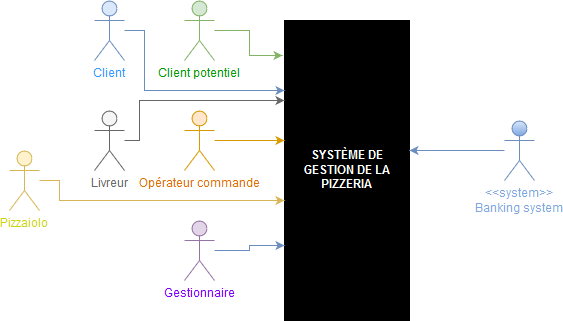

# Introduction

Le présent fichier a pour objectif d'identifier les acteurs présents dans le contexte de la pizzeria. Il inclut une description succincte de chaque acteur et isole les cas d'utilisation attribués à chacun d'entre eux. Une identification des rôles sera menée afin de lister l'ensemble des éléments utiles à la constitution d'un diagramme de contexte et d'un diagramme de *packages*.

Les acteurs constituent en eux-mêmes les personnes réelles identifiées, tandis que les rôles permettent de regrouper les actions communes à ces acteurs en ensembles cohérents, plus utiles à la description des actions. Les rôles sont donc des généralisations.

La collecte des rôles correspond à une volonté de faciliter la lecture des prochains diagrammes : les acteurs ne seront plus spécialement représentés, si leur rôle suffit à expliciter un package ou un cas d'utilisation.

Afin de proposer une version graphique listant les acteurs, se référer au [diagramme de contexte](../diagrammes/diag-contexte.png). Celui-ci est également disponible en fin de fichier.

# Table des matières
- [Introduction](#introduction)
- [Liste des acteurs principaux](#liste-des-acteurs-principaux)
    - [Le client potentiel](#le-client-potentiel)
    - [Le client](#le-client)
    - [Le livreur](#le-livreur)
    - [Le pizzaiolo](#le-pizzaiolo)
    - [L'opérateur de commandes](#l-op-rateur-de-commandes)
    - [Le gestionnaire](#le-gestionnaire)
- [Liste des acteurs secondaires](#liste-des-acteurs-secondaires)
    - [Le système bancaire (*banking system*)](#le-syst-me-bancaire-banking-system-)
- [Liste des rôles](#liste-des-r-les)
    - [L'utilisateur](#l-utilisateur)
    - [L'utilisateur externe](#l-utilisateur-externe)
    - [L'utilisateur interne](#l-utilisateur-interne)
    - [Le passeur de commandes](#le-passeur-de-commandes)
    - [L'employé](#l-employe)
- [Diagramme de contexte](#diagramme-de-contexte)

# Liste des acteurs principaux

## Le client potentiel

Le client potentiel correspond à une personne externe, non identifiée par le système. Ses rôles sont très limités, à savoir la simple consultation du catalogue de vente ainsi qu'un accès à une page d'inscription, lui permettant ainsi de s'enregistrer en vue d'une connexion. Il doit pouvoir se constituer un panier, même sans être loggé, afin de lui offrir une interface utilisateur interactive.

UC identifiés :
- Authentification (inscription)
- Commandes (constitution d'un panier)

Rôle associé :
- [Utilisateur externe](#l-utilisateur-externe)

## Le client

Le client est l'utilisateur cible du site web. Il doit avoir accès au catalogue ainsi que passer commande. Il est nécessaire que le client puisse consulter, modifier et annuler ses commandes (tant que cela est encore possible).

Cet acteur est assez similaire au [client potentiel](#le-client-potentiel), en élargissant tout de même ses droits d'accès.

UC identifiés :
- Authentification (connexion)
- Commandes (consultation, constitution d'un panier, création, modification, suppression, suivi)
- Gestion (compte utilisateur personnel)

Rôles associés :
- [Utilisateur externe](#l-utilisateur-externe)
- [Passeur de commandes](#le-passeur-de-commandes)

## Le livreur

Le livreur doit pouvoir se connecter en tant qu'utilisateur interne du système. Afin de pouvoir faire son travail, l'accès aux commandes est nécessaire : le livreur pourra ainsi récupérer les adresses associées aux pizzas qu'il doit livrer et notifier la bonne livraison dans le système.

UC identifiés :
- Authentification (connexion)
- Commandes (consultation, notification de fin de livraison)

Rôle associé :
- [Utilisateur interne](#l-utilisateur-interne)

## Le pizzaiolo

Le pizzaiolo doit pouvoir s'identifier au système et consulter le catalogue de recettes. Il pourra avoir le droit de saisir une nouvelle recette ainsi que, si cela semble utile, consulter les stocks.

UC identifiés :
- Authentification (connexion)
- Gestion (recettes, consultation du stock)

Rôle associé :
- [Utilisateur interne](#l-utilisateur-interne)

## L'opérateur de commandes

L'opérateur de commandes doit pouvoir se connecter et gérer les commandes de la saisie à la notification de livraison. Recevant des commandes par téléphone, il doit pouvoir consulter la liste des comptes utilisateurs et avoir le droit d'en créer afin d'associer la commande au bon compte client.

UC identifiés :
- Authentification (connexion)
- Gestion (comptes utilisateurs)
- Commandes (gestion complète)

Rôles associés :
- [Utilisateur interne](#l-utilisateur-interne)
- [Passeur de commandes](#le-passeur-de-commandes)

## Le gestionnaire

Le gestionnaire peut être considéré comme un superviseur du système. Il lui faut donc les droits de consultation et de gestion pour l'ensemble des éléments existants.

UC identifiés :
- Authentification (connexion)
- Commandes (gestion complète)
- Gestion (complète)

Rôles associés :
- [Utilisateur interne](#l-utilisateur-interne)
- [Passeur de commandes](#le-passeur-de-commandes)
- [Administrateur](#l-administrateur)

# Liste des acteurs secondaires

## Le système bancaire (*banking system*)
Acteur secondaire de type système, le *banking system* permettra l'interaction entre le site web et les banques (ou autres intervenants type PayPal).

UC identifiés :
- Commandes (paiement)

# Liste des rôles

## L'utilisateur

L'utilisateur est le rôle central, servant de parent à l'ensemble des autres rôles (et donc de tous les acteurs), chacun d'entre eux ayant par défaut le droit de s'authentifier (soit en s'inscrivant, soit en se connectant), le droit de consulter des éléments du site (le catalogue *a minima*) et le droit de se constituer un panier.

## L'utilisateur externe

L'utilisateur externe correspond aux personnes ne faisant pas partie de l'équipe du restaurant. Ses actions sont assez restreintes par rapport au système : il doit pouvoir s'inscrire, se connecter, consulter le catalogue, gérer ses commandes et son compte utilisateur.

## L'utilisateur interne

L'utilisateur interne est un employé du restaurant ou un client inscrit. Il regroupe un panel d'acteurs et de rôles. Chaque utilisateur interne doit *a minima* pouvoir s'identifier sur le site et gérer son compte.

## Le passeur de commandes

Le "passeur de commandes" (faute de meilleur nom) correspond à tout acteur accédant au module de gestion des commandes. Ce rôle permet la généralisation des étapes à suivre, de la constitution du panier au paiement, en passant par le suivi de commande. Il peut s'agir d'un utilisateur externe (ex. client) ou interne (ex. opérateur de commandes).

## L'employé

L'employé est un membre de l'équipe de la pizzeria.

# Diagramme de contexte

