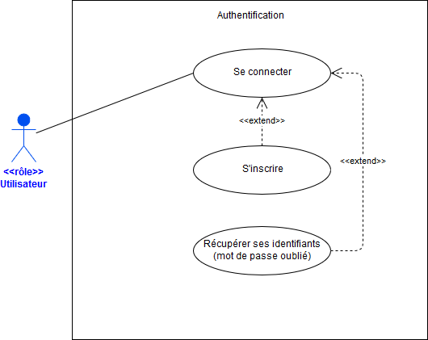

# UC : Authentification

Lorsqu'un **Utilisateur** cherche à se connecter au site web afin d'accéder à une session personnalisée, il doit s'identifier.

Pour ce faire, l'**Utilisateur** doit tout d'abord se rendre sur une page permettant l'authentification. Il lui est demandé dans ce formulaire de fournir les informations nécessaires à sa connexion, soit traditionnellement une adresse email ainsi qu'un mot de passe.

À la soumission du formulaire, l'**Utilisateur** est connecté si le système valide les valeurs saisies.

Si l'**Utilisateur** ne se souvient plus de ses identifiants, ***se référer à l'extension "mot de passe oublié"***.

Si l'**Utilisateur** n'a pas encore de compte, ***se référer à l'extension "inscription"***.

À noter que toutes les actions menées avant la connexion doivent être consignées dans un cookie afin d'en garantir la bonne sauvegarde et permettre l'exploitation de ces informations ultérieurement.

## Diagramme de cas

