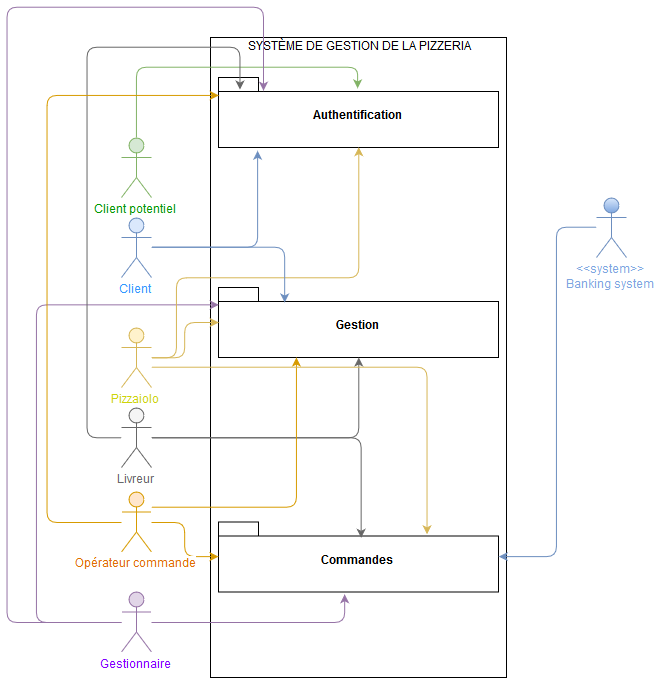

# Introduction

Le présent fichier a pour objectif d'identifier les *packages* dans le contexte de la pizzeria. Par *package* est entendu un ensemble de cas d'utilisation (UC) ayant une appartenance similaire.

Ce document inclut une description succincte de chaque *package* et isole les cas d'utilisation que ceux-ci regroupent.

Les objectifs de ce document sont multiples. Il permettra tout d'abord d'identifier l'ensemble des UC et des *packages* mais également de les lier aux rôles et acteurs identifiés pour le système (se référer au document sur [les acteurs et les rôles](../acteurs/acteurs-rôles.md)). Une première identification des UC a été effectuée dans ce document.

Les rôles seront mentionnés **en gras**, tandis que les acteurs seront *en italique*.

Chaque UC identifié sera décrit en détail dans un fichier séparé, présent dans le même dossier que ce document.

Afin de proposer une version graphique listant les *packages*, se référer au [diagramme de *packages*](../diagrammes/diag-packages.png). Celui-ci est également disponible en fin de fichier.

# Liste des packages

## Authentification

Ce *package* regroupe l'ensemble des UC concernant l'authentification des utilisateurs. Il regroupe ainsi les cas d'utilisation relatifs à

| Cas d'utilisation | Acteur(s) et/ou rôle(s) identifié(s) |
|-------------------|--------------------------------------|
| Inscription       | **Utilisateur**                      |
| Connexion         | **Utilisateur interne**              |

## Consultation

Nous retrouvons ici toutes les opérations de consultation, i.e. les actions de type "lecture seule". Ce *package* inclut les UC suivants :

| Cas d'utilisation                     | Acteur(s) et/ou rôle(s) identifié(s)       |
|---------------------------------------|--------------------------------------------|
| Consultation du catalogue             | **Utilisateur**                            |
| Consultation du stock                 | *Gestionnaire* ; *pizzaiolo*               |
| Consultation des recettes             | *Gestionnaire* ; *pizzaiolo*               |
| Consultation des commandes            | **Passeur de commande** ; *Gestionnaire*   |
| Consultation des comptes utilisateurs | *Client* ; **Utilisateur interne**         |

## Gestion

Les opérations de gestion sont multiples et concernent l'ensemble des éléments constitutifs du système. Les autorisations de gestion diffèrent selon les acteurs.

| Cas d'utilisation                        | Acteur(s) et/ou rôle(s) identifié(s) |
|------------------------------------------|--------------------------------------|
| Gestion de son propre compte utilisateur | **Utilisateur interne**              |
| Gestion des comptes utilisateurs         | **Administrateur**                   |
| Gestion des recettes                     | **Administrateur** ; *Pizzaiolo*     |
| Gestion des stocks                       | **Administrateur**                   |

## Commandes

Bien que proche des cas de gestion, la gestion des commandes est isolée car celle-ci demande un panel plus vaste de cas d'utilisation. Il apparaît plus efficace d'en faire un *package* à part afin de faciliter la lecture de cas.

Le *package* commandes concerne l'ensemble des opérations liées à la commande, à savoir :

| Cas d'utilisation           | Acteur(s) et/ou rôle(s) identifié(s)          |
|-----------------------------|-----------------------------------------------|
| Constitution d'un panier    | *Client potentiel* ; **Passeur de commandes** |
| Création d'une commande     | **Passeur de commandes**                      |
| Modification d'une commande | **Passeur de commandes**                      |
| Suppression d'une commande  | **Passeur de commandes**                      |
| Suivi de commandes          | **Passeur de commandes** ; *Livreur*          |
| Notification de livraison   | *Livreur*

## Administration système

L'administration système regroupe l'ensemble des opérations ayant trait à la partie informatique du système.

| Cas d'utilisation                    | Acteur(s) et/ou rôle(s) identifié(s) |
|--------------------------------------|--------------------------------------|
| Administration du serveur            | **Administrateur**                   |
| Administration du serveur web        | **Administrateur**                   |
| Administration de la base de données | **Administrateur**                   |
| Administration du code source        | **Administrateur**                   |

# Diagramme de *packages*

